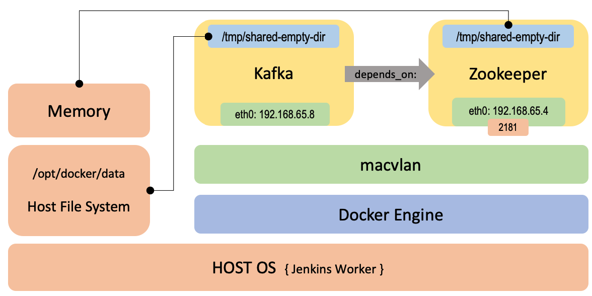

# ZooKeeper and Kafka Docker Compose Setup

This Docker Compose configuration sets up a multi-container environment with ZooKeeper and Kafka. <br>
It includes one replica of ZooKeeper (zook-container) and a single instance of Kafka (kaff). <br>
The setup is designed to work as part of a larger distributed system inside Jenkins Worker.

## Architecture Diagram


## Services

### ZooKeeper Service (zook-container)

- Image: serhiihladyr/zook-compose-1:02
- Domainname: zook.cluster.local
- Ports: Maps host port 2181 to container port 2181 (TCP protocol).
- Hostname: zook

### Kafka Service (kaff)
- Image: serhiihladyr/kaff-compose-1:02
- Hostname: kaff
- Ports: Maps host port 9092 to container port 9092.
- Depends on: zook-container (waits for it to be ready).

## Volumes
Defines a volume named `zook-empty-dir`.

## Usage
1. Ensure you have Docker and Docker Compose installed on your system.
2. Clone this repository.
3. Customize the configuration files as needed.
4. Run the following command to start the services:
```commandline
docker-compose -f compose.yml  up
```
5. Monitor the logs and check the status of the containers.

## Configuration
Adjust environment variables in the env-zook.env file for ZooKeeper. <br>
Modify Kafka-related configurations in the Kafka service section.